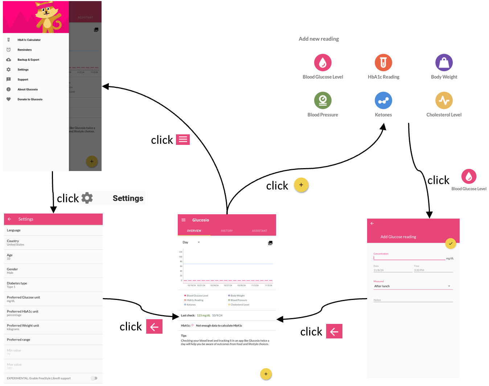

# RLDroid
This repository contains the source code of RLDroid, the evaluation detail and the dataset in our experiments.

## Examples
<table><tr>
<td>

<h1 align="center">Partial UTG of AnkiDroid</h1>

</td>
<td>

<h1 align="center">Partial UTG of Glucosio</h1>

</td>
</tr></table>

## How to use RLDroid

#### Prerequisites
- Java 8 at least
- Android SDK 25 at least
- Android Debug Bridge(ADB)
- Python 3.9
- Uiautomator 2
- Intellij IDEA or Maven
- Android emulator 7.1

#### Usage
- Open the "SeedUTGConstruction" directory with Intellij IDEA and run the main method to build the seed UTG.
- Run the dynamic exploration using python3 utgrunner.py