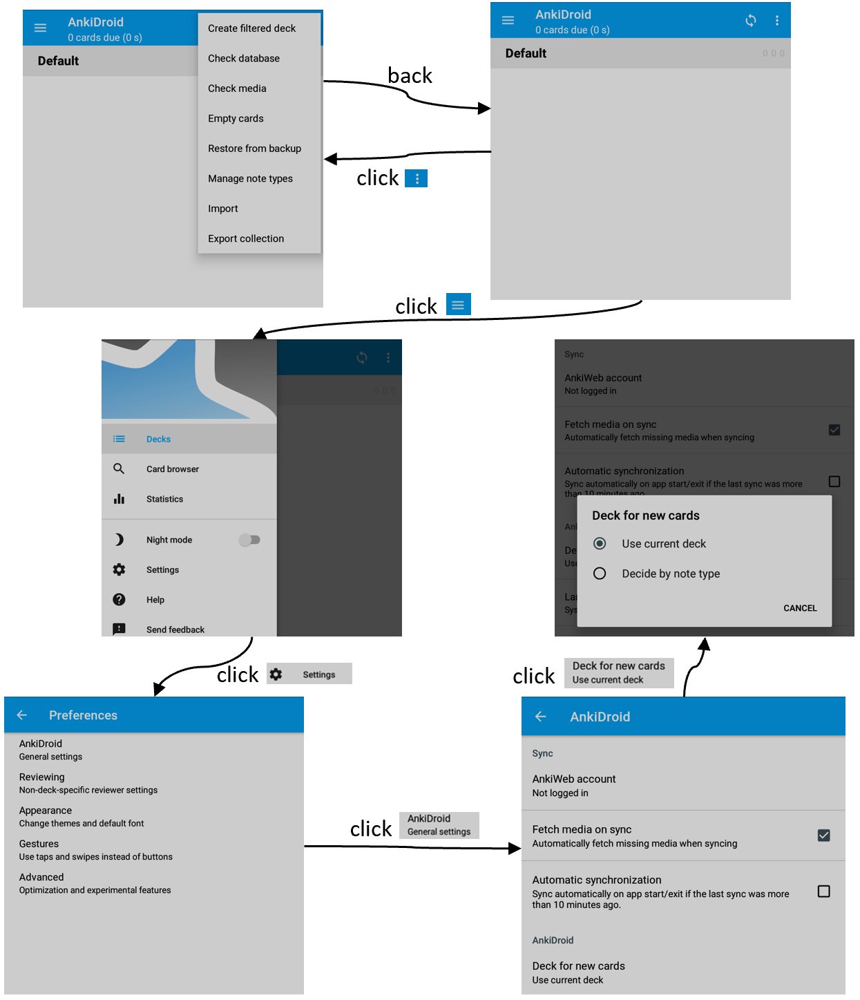

# RLDroid
This repository contains the source code of RLDroid, the evaluation detail and the dataset in our experiments.

## Examples
<table><tr>
<td>

<h1 align="center">Partial UTG of AnkiDroid</h1>

</td>
<td>

<h1 align="center">Partial UTG of Glucosio</h1>

</td>
</tr></table>